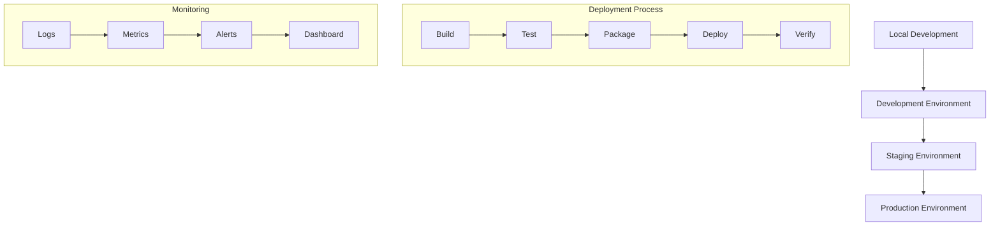

# Deployment Guide

This document outlines the deployment process for the Obsidian AI Assistant project, including environment setup, deployment steps, and monitoring.

## Deployment Overview



## Environment Setup

### Development
```bash
# Install dependencies
pip install -r requirements.txt

# Set up environment variables
cp .env.example .env
# Edit .env with development values

# Run local development server
python manage.py runserver
```

### Staging
```bash
# Deploy to staging
aws deploy create-deployment \
  --application-name obsidian-ai-assistant \
  --deployment-group-name staging \
  --s3-location bucket=obsidian-ai-assistant-staging,key=app.zip,bundleType=zip
```

### Production
```bash
# Deploy to production
aws deploy create-deployment \
  --application-name obsidian-ai-assistant \
  --deployment-group-name production \
  --s3-location bucket=obsidian-ai-assistant-prod,key=app.zip,bundleType=zip
```

## Infrastructure Setup

### AWS Resources
```yaml
# infrastructure.yaml
Resources:
  LambdaFunctions:
    - CreateNote
    - GetNote
    - UpdateNote
    - DeleteNote
    - GenerateEmbeddings
    - SearchNotes
    - ListNotes
    - ProcessMessage
    - CreateTask
    - UpdateTask
    - DeleteTask
    - ListTasks

  DynamoDBTables:
    - notes_metadata
    - tasks_metadata
    - messages_metadata
    - embeddings_metadata

  S3Buckets:
    - note-content
    - task-attachments

  OpenSearchDomain:
    - notes-index
    - tasks-index

  APIGateway:
    - REST API
    - WebSocket API
```

### IAM Roles
```json
{
  "Version": "2012-10-17",
  "Statement": [
    {
      "Effect": "Allow",
      "Action": [
        "dynamodb:GetItem",
        "dynamodb:PutItem",
        "dynamodb:UpdateItem",
        "dynamodb:DeleteItem",
        "dynamodb:Query",
        "dynamodb:Scan"
      ],
      "Resource": [
        "arn:aws:dynamodb:*:*:table/notes_metadata",
        "arn:aws:dynamodb:*:*:table/tasks_metadata",
        "arn:aws:dynamodb:*:*:table/messages_metadata"
      ]
    }
  ]
}
```

## Deployment Process

### 1. Build
```bash
# Install dependencies
pip install -r requirements.txt

# Run tests
pytest

# Package application
zip -r app.zip . -x "*.git*" -x "*.env*" -x "*.pytest_cache*"
```

### 2. Deploy
```bash
# Upload to S3
aws s3 cp app.zip s3://obsidian-ai-assistant-${ENV}/app.zip

# Create deployment
aws deploy create-deployment \
  --application-name obsidian-ai-assistant \
  --deployment-group-name ${ENV} \
  --s3-location bucket=obsidian-ai-assistant-${ENV},key=app.zip,bundleType=zip
```

### 3. Verify
```bash
# Check deployment status
aws deploy get-deployment --deployment-id ${DEPLOYMENT_ID}

# Verify endpoints
curl -X POST https://api.obsidian-ai-assistant.${ENV}/notes \
  -H "Content-Type: application/json" \
  -d '{"title": "Test Note", "content": "Test Content"}'
```

## Monitoring

### CloudWatch Metrics
```yaml
Metrics:
  - Lambda:
      - Invocations
      - Duration
      - Errors
      - Throttles
  - DynamoDB:
      - ConsumedReadCapacityUnits
      - ConsumedWriteCapacityUnits
      - ThrottledRequests
  - API Gateway:
      - Count
      - Latency
      - 4XXError
      - 5XXError
```

### Alerts
```yaml
Alerts:
  - HighErrorRate:
      Threshold: 1%
      Period: 5 minutes
      EvaluationPeriods: 2
  - HighLatency:
      Threshold: 1000ms
      Period: 5 minutes
      EvaluationPeriods: 2
  - HighThrottleRate:
      Threshold: 5%
      Period: 5 minutes
      EvaluationPeriods: 2
```

## Rollback Procedures

### Automatic Rollback
```yaml
DeploymentConfiguration:
  MinimumHealthyHosts:
    Type: HOST_COUNT
    Value: 1
  DeploymentStyle:
    DeploymentType: BLUE_GREEN
    DeploymentOption: WITH_TRAFFIC_CONTROL
  Alarms:
    - HighErrorRate
    - HighLatency
```

### Manual Rollback
```bash
# Get previous deployment
aws deploy get-deployment --deployment-id ${PREVIOUS_DEPLOYMENT_ID}

# Rollback to previous version
aws deploy create-deployment \
  --application-name obsidian-ai-assistant \
  --deployment-group-name ${ENV} \
  --revision revisionType=S3,s3Location={bucket=obsidian-ai-assistant-${ENV},key=previous-app.zip,bundleType=zip}
```

## Security

### Secrets Management
```yaml
Secrets:
  - OpenAIAPIKey:
      Type: AWS::SecretsManager::Secret
      Properties:
        Name: /obsidian-ai-assistant/${ENV}/openai-api-key
        Description: OpenAI API Key
        SecretString: ${OPENAI_API_KEY}
```

### Encryption
```yaml
Encryption:
  - AtRest:
      - DynamoDB: AWS KMS
      - S3: AES-256
      - OpenSearch: AWS KMS
  - InTransit:
      - API Gateway: TLS 1.2
      - Lambda: TLS 1.2
```

## Best Practices

### Deployment
- Blue-green deployment
- Canary releases
- Feature flags
- A/B testing

### Monitoring
- Real-time alerts
- Performance tracking
- Error tracking
- Cost monitoring

### Security
- Regular updates
- Security scanning
- Access control
- Audit logging 