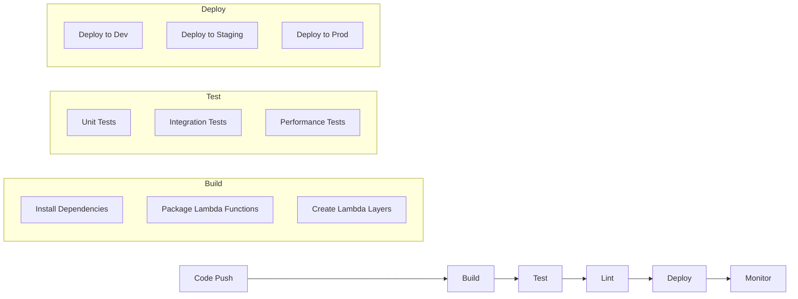

# CI/CD Pipeline

This document describes the Continuous Integration and Continuous Deployment (CI/CD) pipeline for the Obsidian AI Assistant project.

## Pipeline Overview



## Pipeline Stages

### 1. Build Stage

#### Dependencies
- Python 3.9+
- Node.js 16+
- AWS CLI
- Docker

#### Build Process
1. Install project dependencies
2. Package Lambda functions
3. Create Lambda layers
4. Build frontend assets
5. Generate documentation

### 2. Test Stage

#### Unit Tests
- Python pytest
- Jest for frontend
- Coverage requirements
- Mock AWS services

#### Integration Tests
- API endpoint testing
- Database operations
- S3 operations
- Lambda function testing

#### Performance Tests
- Load testing
- Response time testing
- Resource utilization
- Cost optimization

### 3. Lint Stage

#### Code Quality
- Python flake8
- Black formatting
- Type checking
- Security scanning

#### Documentation
- API documentation
- Code documentation
- Architecture diagrams
- README updates

### 4. Deploy Stage

#### Environments
1. Development
   - Automated deployment
   - Feature testing
   - Integration testing

2. Staging
   - Manual approval
   - User acceptance
   - Performance testing

3. Production
   - Manual approval
   - Blue-green deployment
   - Rollback capability

#### Deployment Process
1. Package application
2. Deploy to AWS
3. Update infrastructure
4. Verify deployment

### 5. Monitor Stage

#### Monitoring
- CloudWatch metrics
- Error tracking
- Performance monitoring
- Cost tracking

#### Alerts
- Error rate alerts
- Performance alerts
- Cost alerts
- Security alerts

## Pipeline Configuration

### GitHub Actions Workflow
```yaml
name: CI/CD Pipeline

on:
  push:
    branches: [ main, develop ]
  pull_request:
    branches: [ main, develop ]

jobs:
  build:
    runs-on: ubuntu-latest
    steps:
      - uses: actions/checkout@v2
      - name: Set up Python
        uses: actions/setup-python@v2
      - name: Install dependencies
        run: |
          python -m pip install --upgrade pip
          pip install -r requirements.txt
      - name: Run tests
        run: |
          pytest
      - name: Deploy
        if: github.ref == 'refs/heads/main'
        run: |
          aws deploy create-deployment
```

### AWS Deployment
```yaml
version: 0.0
os: linux
files:
  - source: /
    destination: /var/www/html/
hooks:
  BeforeInstall:
    - location: scripts/before_install.sh
      timeout: 300
      runas: root
  AfterInstall:
    - location: scripts/after_install.sh
      timeout: 300
      runas: root
  ApplicationStart:
    - location: scripts/start_application.sh
      timeout: 300
      runas: root
  ValidateService:
    - location: scripts/validate_service.sh
      timeout: 300
      runas: root
```

## Security

### Secrets Management
- AWS Secrets Manager
- GitHub Secrets
- Environment variables
- IAM roles

### Access Control
- Role-based access
- Least privilege principle
- Audit logging
- Security scanning

## Monitoring

### Metrics
- Build success rate
- Test coverage
- Deployment time
- Error rates

### Logging
- Build logs
- Test logs
- Deployment logs
- Application logs

## Rollback Procedures

### Automatic Rollback
1. Detect deployment failure
2. Trigger rollback
3. Restore previous version
4. Verify restoration

### Manual Rollback
1. Identify issues
2. Select previous version
3. Execute rollback
4. Verify functionality

## Best Practices

### Code Quality
- Regular code reviews
- Automated testing
- Documentation updates
- Security scanning

### Deployment
- Blue-green deployment
- Canary releases
- Feature flags
- A/B testing

### Monitoring
- Real-time alerts
- Performance tracking
- Error tracking
- Cost monitoring 