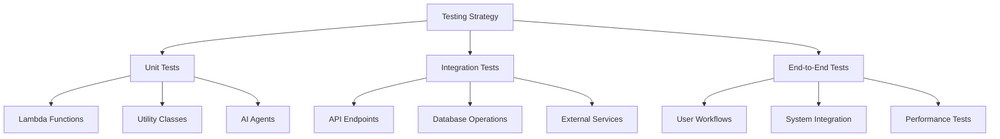

# Testing Strategy

This document outlines the testing strategy for the Obsidian AI Assistant project, including unit tests, integration tests, and end-to-end tests.

## Testing Overview



## Test Types

### 1. Unit Tests

#### Lambda Functions
- Input validation
- Error handling
- Business logic
- Edge cases

#### Utility Classes
- Helper functions
- Data transformation
- Validation logic
- Error handling

#### AI Agents
- Message processing
- Task interpretation
- Note generation
- Response formatting

### 2. Integration Tests

#### API Endpoints
- Request/response handling
- Authentication/authorization
- Rate limiting
- Error responses

#### Database Operations
- CRUD operations
- Query performance
- Data consistency
- Error handling

#### External Services
- AWS service integration
- OpenAI API calls
- File operations
- Message queue

### 3. End-to-End Tests

#### User Workflows
- Task creation
- Note management
- Project organization
- Search functionality

#### System Integration
- Component interaction
- Data flow
- State management
- Error recovery

#### Performance Tests
- Load testing
- Response time
- Resource usage
- Scalability

## Test Framework

### Python Testing
```python
import pytest
from unittest.mock import Mock, patch

def test_create_task():
    # Arrange
    task_data = {
        "title": "Test Task",
        "description": "Test Description",
        "priority": "high"
    }
    
    # Act
    result = create_task(task_data)
    
    # Assert
    assert result["task_id"] is not None
    assert result["status"] == "todo"
    assert result["created_at"] is not None

def test_process_message():
    # Arrange
    message = {
        "content": "Create a new task for project planning",
        "type": "task",
        "metadata": {"user_id": "123"}
    }
    
    # Act
    with patch('app.process_task') as mock_process:
        result = process_message(message)
    
    # Assert
    mock_process.assert_called_once()
    assert result["status"] == "processed"
```

### Test Configuration
```python
# pytest.ini
[pytest]
testpaths = tests
python_files = test_*.py
python_classes = Test*
python_functions = test_*
addopts = -v --cov=app --cov-report=term-missing
```

## Test Data

### Fixtures
```python
@pytest.fixture
def sample_task():
    return {
        "task_id": "test-uuid",
        "title": "Sample Task",
        "description": "Sample Description",
        "status": "todo",
        "created_at": "2024-03-26T00:00:00Z",
        "updated_at": "2024-03-26T00:00:00Z",
        "priority": "high",
        "project_id": "project-uuid"
    }

@pytest.fixture
def sample_note():
    return {
        "note_id": "test-uuid",
        "title": "Sample Note",
        "content": "# Sample Note\nThis is a test note.",
        "created_at": "2024-03-26T00:00:00Z",
        "updated_at": "2024-03-26T00:00:00Z",
        "tags": ["test", "sample"]
    }
```

### Mock Data
```python
@pytest.fixture
def mock_dynamodb():
    with patch('boto3.resource') as mock:
        mock_table = Mock()
        mock_table.get_item.return_value = {
            'Item': {
                'task_id': 'test-uuid',
                'title': 'Test Task'
            }
        }
        mock.return_value.Table.return_value = mock_table
        yield mock_table

@pytest.fixture
def mock_openai():
    with patch('openai.Embedding.create') as mock:
        mock.return_value = {
            'data': [{
                'embedding': [0.1, 0.2, 0.3]
            }]
        }
        yield mock
```

## Test Coverage

### Coverage Requirements
- Minimum 90% code coverage
- 100% coverage for critical paths
- 100% coverage for error handling
- 100% coverage for security features

### Coverage Report
```bash
# Generate coverage report
pytest --cov=app --cov-report=html

# View coverage report
open htmlcov/index.html
```

## Test Automation

### GitHub Actions
```yaml
name: Run Tests

on:
  push:
    branches: [ main, develop ]
  pull_request:
    branches: [ main, develop ]

jobs:
  test:
    runs-on: ubuntu-latest
    steps:
      - uses: actions/checkout@v2
      - name: Set up Python
        uses: actions/setup-python@v2
      - name: Install dependencies
        run: |
          python -m pip install --upgrade pip
          pip install -r requirements.txt
      - name: Run tests
        run: |
          pytest
      - name: Upload coverage
        uses: codecov/codecov-action@v1
```

## Best Practices

### Test Organization
- One test file per module
- Clear test names
- Proper test isolation
- Reusable fixtures

### Test Quality
- Comprehensive assertions
- Edge case coverage
- Error scenario testing
- Performance testing

### Test Maintenance
- Regular updates
- Documentation
- Code review
- Refactoring

## Continuous Testing

### Pre-commit Hooks
```yaml
# .pre-commit-config.yaml
repos:
  - repo: local
    hooks:
      - id: pytest
        name: pytest
        entry: pytest
        language: system
        types: [python]
        pass_filenames: false
```

### Test Environment
- Local development
- CI/CD pipeline
- Staging environment
- Production environment 