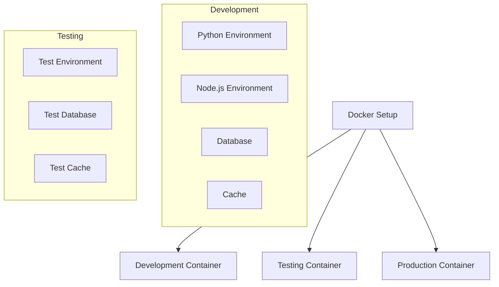

# Docker Setup

This document outlines the Docker setup for local development and testing of the Obsidian AI Assistant project.

## Docker Overview



## Development Environment

### Dockerfile
```dockerfile
# Use Python 3.9 slim image
FROM python:3.9-slim

# Set working directory
WORKDIR /app

# Install system dependencies
RUN apt-get update && apt-get install -y \
    build-essential \
    curl \
    git \
    && rm -rf /var/lib/apt/lists/*

# Install Python dependencies
COPY requirements.txt .
RUN pip install --no-cache-dir -r requirements.txt

# Install development dependencies
COPY requirements-dev.txt .
RUN pip install --no-cache-dir -r requirements-dev.txt

# Copy application code
COPY . .

# Set environment variables
ENV PYTHONPATH=/app
ENV PYTHONUNBUFFERED=1

# Run development server
CMD ["python", "manage.py", "runserver", "0.0.0.0:8000"]
```

### Docker Compose
```yaml
# docker-compose.yml
version: '3.8'

services:
  app:
    build:
      context: .
      dockerfile: Dockerfile
    volumes:
      - .:/app
    ports:
      - "8000:8000"
    environment:
      - AWS_ACCESS_KEY_ID=${AWS_ACCESS_KEY_ID}
      - AWS_SECRET_ACCESS_KEY=${AWS_SECRET_ACCESS_KEY}
      - AWS_DEFAULT_REGION=${AWS_DEFAULT_REGION}
      - OPENAI_API_KEY=${OPENAI_API_KEY}
    depends_on:
      - dynamodb-local
      - s3-local
      - opensearch-local

  dynamodb-local:
    image: amazon/dynamodb-local:latest
    ports:
      - "8000:8000"
    volumes:
      - dynamodb-data:/home/dynamodblocal/data

  s3-local:
    image: localstack/localstack:latest
    ports:
      - "4566:4566"
    environment:
      - SERVICES=s3
      - DEFAULT_REGION=${AWS_DEFAULT_REGION}
      - AWS_ACCESS_KEY_ID=${AWS_ACCESS_KEY_ID}
      - AWS_SECRET_ACCESS_KEY=${AWS_SECRET_ACCESS_KEY}
    volumes:
      - s3-data:/var/lib/localstack/data

  opensearch-local:
    image: opensearchproject/opensearch:latest
    ports:
      - "9200:9200"
    environment:
      - discovery.type=single-node
      - OPENSEARCH_JAVA_OPTS=-Xms512m -Xmx512m
    volumes:
      - opensearch-data:/usr/share/opensearch/data

volumes:
  dynamodb-data:
  s3-data:
  opensearch-data:
```

## Testing Environment

### Test Dockerfile
```dockerfile
# Use Python 3.9 slim image
FROM python:3.9-slim

# Set working directory
WORKDIR /app

# Install system dependencies
RUN apt-get update && apt-get install -y \
    build-essential \
    curl \
    git \
    && rm -rf /var/lib/apt/lists/*

# Install Python dependencies
COPY requirements.txt .
RUN pip install --no-cache-dir -r requirements.txt

# Install test dependencies
COPY requirements-dev.txt .
RUN pip install --no-cache-dir -r requirements-dev.txt

# Copy application code
COPY . .

# Set environment variables
ENV PYTHONPATH=/app
ENV PYTHONUNBUFFERED=1
ENV TESTING=true

# Run tests
CMD ["pytest"]
```

### Test Docker Compose
```yaml
# docker-compose.test.yml
version: '3.8'

services:
  test:
    build:
      context: .
      dockerfile: Dockerfile.test
    volumes:
      - .:/app
    environment:
      - AWS_ACCESS_KEY_ID=${AWS_ACCESS_KEY_ID}
      - AWS_SECRET_ACCESS_KEY=${AWS_SECRET_ACCESS_KEY}
      - AWS_DEFAULT_REGION=${AWS_DEFAULT_REGION}
      - OPENAI_API_KEY=${OPENAI_API_KEY}
      - TESTING=true
    depends_on:
      - dynamodb-test
      - s3-test
      - opensearch-test

  dynamodb-test:
    image: amazon/dynamodb-local:latest
    ports:
      - "8001:8000"
    volumes:
      - dynamodb-test-data:/home/dynamodblocal/data

  s3-test:
    image: localstack/localstack:latest
    ports:
      - "4567:4566"
    environment:
      - SERVICES=s3
      - DEFAULT_REGION=${AWS_DEFAULT_REGION}
      - AWS_ACCESS_KEY_ID=${AWS_ACCESS_KEY_ID}
      - AWS_SECRET_ACCESS_KEY=${AWS_SECRET_ACCESS_KEY}
    volumes:
      - s3-test-data:/var/lib/localstack/data

  opensearch-test:
    image: opensearchproject/opensearch:latest
    ports:
      - "9201:9200"
    environment:
      - discovery.type=single-node
      - OPENSEARCH_JAVA_OPTS=-Xms512m -Xmx512m
    volumes:
      - opensearch-test-data:/usr/share/opensearch/data

volumes:
  dynamodb-test-data:
  s3-test-data:
  opensearch-test-data:
```

## Usage

### Development
```bash
# Build and start development environment
docker-compose up --build

# Stop development environment
docker-compose down

# View logs
docker-compose logs -f

# Run commands in container
docker-compose exec app bash
```

### Testing
```bash
# Run tests
docker-compose -f docker-compose.test.yml up --build

# Stop test environment
docker-compose -f docker-compose.test.yml down

# View test logs
docker-compose -f docker-compose.test.yml logs -f

# Run specific test
docker-compose -f docker-compose.test.yml exec test pytest tests/test_specific.py
```

## Local Development

### Environment Setup
```bash
# Create .env file
cp .env.example .env

# Edit .env with local values
nano .env

# Start development environment
docker-compose up --build
```

### Database Setup
```bash
# Create DynamoDB tables
docker-compose exec app python scripts/create_tables.py

# Create S3 buckets
docker-compose exec app python scripts/create_buckets.py

# Create OpenSearch indices
docker-compose exec app python scripts/create_indices.py
```

### Development Workflow
```bash
# Start development environment
docker-compose up -d

# Run tests
docker-compose -f docker-compose.test.yml up

# View logs
docker-compose logs -f

# Stop all containers
docker-compose down
docker-compose -f docker-compose.test.yml down
```

## Troubleshooting

### Common Issues
1. Port conflicts
   - Check if ports are in use
   - Change port mappings in docker-compose.yml

2. Volume permissions
   - Fix volume permissions
   - Use sudo if needed

3. Environment variables
   - Check .env file
   - Verify variable names

4. Container health
   - Check container logs
   - Verify dependencies

### Debugging
```bash
# View container logs
docker-compose logs -f [service]

# Access container shell
docker-compose exec [service] bash

# Check container status
docker-compose ps

# Rebuild container
docker-compose up --build [service]
```

## Best Practices

### Development
- Use volume mounts for code changes
- Keep dependencies updated
- Follow coding standards
- Write tests

### Testing
- Isolate test environment
- Clean up test data
- Mock external services
- Use test fixtures

### Security
- Use environment variables
- Follow least privilege
- Regular updates
- Security scanning 