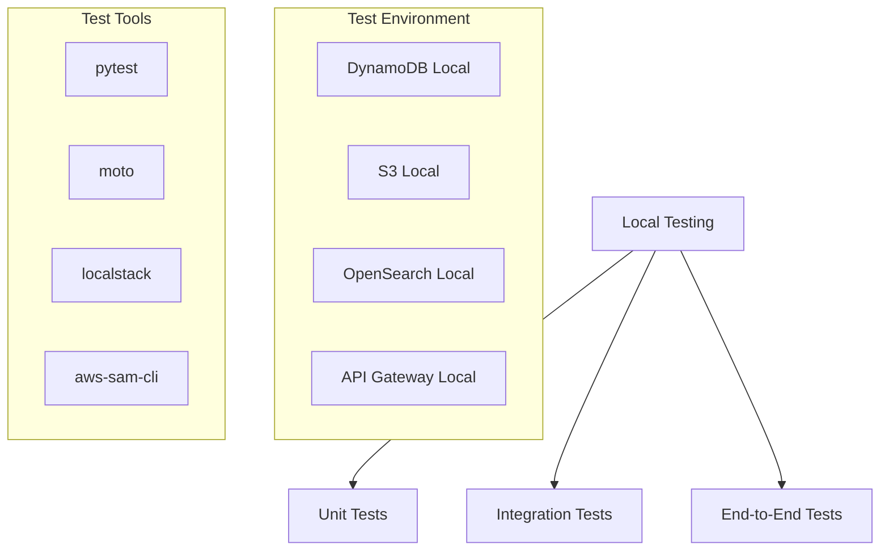

# Local Testing Guide

This document outlines the process for testing Lambda functions locally in the Obsidian AI Assistant project.

## Local Testing Overview



## Test Environment Setup

### 1. Install Dependencies
```bash
# Install Python dependencies
pip install -r requirements-dev.txt

# Install AWS SAM CLI
brew install aws-sam-cli  # macOS
# or
pip install aws-sam-cli   # Linux/Windows
```

### 2. Local Services
```bash
# Start DynamoDB Local
docker run -p 8000:8000 amazon/dynamodb-local

# Start LocalStack (S3)
docker run -p 4566:4566 localstack/localstack

# Start OpenSearch Local
docker run -p 9200:9200 opensearchproject/opensearch
```

### 3. Environment Variables
```bash
# .env.local
AWS_ACCESS_KEY_ID=test
AWS_SECRET_ACCESS_KEY=test
AWS_DEFAULT_REGION=us-east-1
DYNAMODB_ENDPOINT=http://localhost:8000
S3_ENDPOINT=http://localhost:4566
OPENSEARCH_ENDPOINT=http://localhost:9200
```

## Lambda Function Testing

### 1. Unit Tests
```python
# tests/test_create_note.py
import pytest
from moto import mock_dynamodb, mock_s3
from app import create_note

@pytest.fixture
def aws_credentials():
    """Mock AWS credentials for testing."""
    import os
    os.environ['AWS_ACCESS_KEY_ID'] = 'testing'
    os.environ['AWS_SECRET_ACCESS_KEY'] = 'testing'
    os.environ['AWS_SECURITY_TOKEN'] = 'testing'
    os.environ['AWS_SESSION_TOKEN'] = 'testing'
    os.environ['AWS_DEFAULT_REGION'] = 'us-east-1'

@pytest.fixture
def dynamodb(aws_credentials):
    """Create DynamoDB table for testing."""
    with mock_dynamodb():
        dynamodb = boto3.resource('dynamodb', region_name='us-east-1')
        table = dynamodb.create_table(
            TableName='notes_metadata',
            KeySchema=[
                {'AttributeName': 'note_id', 'KeyType': 'HASH'},
                {'AttributeName': 'created_at', 'KeyType': 'RANGE'}
            ],
            AttributeDefinitions=[
                {'AttributeName': 'note_id', 'AttributeType': 'S'},
                {'AttributeName': 'created_at', 'AttributeType': 'S'}
            ],
            ProvisionedThroughput={
                'ReadCapacityUnits': 5,
                'WriteCapacityUnits': 5
            }
        )
        table.meta.client.get_waiter('table_exists').wait(TableName='notes_metadata')
        yield table

def test_create_note_success(dynamodb):
    """Test successful note creation."""
    event = {
        'body': json.dumps({
            'title': 'Test Note',
            'content': 'Test Content'
        })
    }
    
    response = create_note(event, None)
    
    assert response['statusCode'] == 200
    body = json.loads(response['body'])
    assert body['note_id'] is not None
    assert body['title'] == 'Test Note'
```

### 2. Integration Tests
```python
# tests/integration/test_note_flow.py
import pytest
from localstack_client.session import Session
from app import create_note, get_note, update_note, delete_note

@pytest.fixture
def localstack():
    """Set up LocalStack for integration testing."""
    session = Session()
    return session.client('s3')

def test_note_crud_flow(localstack):
    """Test complete note CRUD flow."""
    # Create note
    create_event = {
        'body': json.dumps({
            'title': 'Integration Test Note',
            'content': 'Test Content'
        })
    }
    create_response = create_note(create_event, None)
    note_id = json.loads(create_response['body'])['note_id']
    
    # Get note
    get_event = {
        'pathParameters': {'id': note_id}
    }
    get_response = get_note(get_event, None)
    assert get_response['statusCode'] == 200
    
    # Update note
    update_event = {
        'pathParameters': {'id': note_id},
        'body': json.dumps({
            'title': 'Updated Note',
            'content': 'Updated Content'
        })
    }
    update_response = update_note(update_event, None)
    assert update_response['statusCode'] == 200
    
    # Delete note
    delete_event = {
        'pathParameters': {'id': note_id}
    }
    delete_response = delete_note(delete_event, None)
    assert delete_response['statusCode'] == 200
```

### 3. End-to-End Tests
```python
# tests/e2e/test_user_workflow.py
import pytest
from app import process_message, create_task, update_task, list_tasks

def test_task_creation_workflow():
    """Test complete task creation workflow."""
    # Process message
    message_event = {
        'body': json.dumps({
            'content': 'Create a new task for project planning',
            'type': 'task',
            'metadata': {
                'user_id': 'test-user',
                'priority': 'high'
            }
        })
    }
    message_response = process_message(message_event, None)
    assert message_response['statusCode'] == 200
    
    # Verify task creation
    task_id = json.loads(message_response['body'])['task_id']
    list_response = list_tasks({}, None)
    tasks = json.loads(list_response['body'])['tasks']
    assert any(task['task_id'] == task_id for task in tasks)
```

## API Testing

### 1. Local API Gateway
```bash
# Start local API Gateway
sam local start-api

# Test endpoints
curl -X POST http://localhost:3000/notes \
  -H "Content-Type: application/json" \
  -d '{"title": "Test Note", "content": "Test Content"}'
```

### 2. API Tests
```python
# tests/api/test_endpoints.py
import requests
import pytest

BASE_URL = 'http://localhost:3000'

def test_create_note_endpoint():
    """Test note creation endpoint."""
    response = requests.post(
        f'{BASE_URL}/notes',
        json={
            'title': 'API Test Note',
            'content': 'Test Content'
        }
    )
    assert response.status_code == 200
    data = response.json()
    assert data['note_id'] is not None

def test_get_note_endpoint():
    """Test note retrieval endpoint."""
    # Create note first
    create_response = requests.post(
        f'{BASE_URL}/notes',
        json={
            'title': 'API Test Note',
            'content': 'Test Content'
        }
    )
    note_id = create_response.json()['note_id']
    
    # Get note
    get_response = requests.get(f'{BASE_URL}/notes/{note_id}')
    assert get_response.status_code == 200
    data = get_response.json()
    assert data['note_id'] == note_id
```

## Performance Testing

### 1. Load Tests
```python
# tests/performance/test_load.py
import locust
from locust import HttpUser, task, between

class NoteUser(HttpUser):
    wait_time = between(1, 3)
    
    @task
    def create_note(self):
        self.client.post(
            "/notes",
            json={
                "title": "Load Test Note",
                "content": "Test Content"
            }
        )
    
    @task
    def get_notes(self):
        self.client.get("/notes")
```

### 2. Run Load Tests
```bash
# Start Locust
locust -f tests/performance/test_load.py

# Open browser at http://localhost:8089
```

## Test Data Management

### 1. Test Fixtures
```python
# tests/fixtures.py
@pytest.fixture
def sample_note():
    return {
        'note_id': 'test-uuid',
        'title': 'Test Note',
        'content': '# Test Note\nThis is a test note.',
        'created_at': '2024-03-26T00:00:00Z',
        'updated_at': '2024-03-26T00:00:00Z',
        'tags': ['test', 'sample']
    }

@pytest.fixture
def sample_task():
    return {
        'task_id': 'test-uuid',
        'title': 'Test Task',
        'description': 'Test Description',
        'status': 'todo',
        'priority': 'high',
        'created_at': '2024-03-26T00:00:00Z',
        'updated_at': '2024-03-26T00:00:00Z'
    }
```

### 2. Test Database
```python
# tests/db.py
def setup_test_db():
    """Set up test database."""
    dynamodb = boto3.resource('dynamodb', endpoint_url='http://localhost:8000')
    
    # Create tables
    create_tables(dynamodb)
    
    # Load test data
    load_test_data(dynamodb)
    
    return dynamodb

def teardown_test_db():
    """Clean up test database."""
    dynamodb = boto3.resource('dynamodb', endpoint_url='http://localhost:8000')
    
    # Delete tables
    delete_tables(dynamodb)
```

## Best Practices

### Test Organization
- Separate unit, integration, and e2e tests
- Use fixtures for common setup
- Mock external services
- Clean up test data

### Test Quality
- Comprehensive assertions
- Edge case coverage
- Error scenario testing
- Performance testing

### Test Maintenance
- Regular updates
- Documentation
- Code review
- Refactoring 