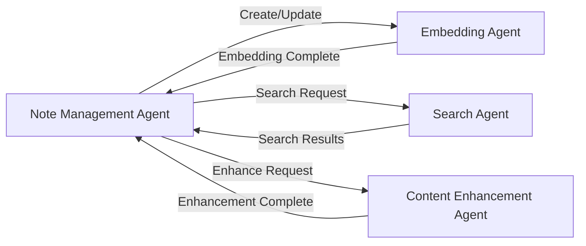

# AI Agents

This document describes the AI agents used in the Obsidian AI Assistant system, their roles, tools, and how they collaborate.

## Agent Overview

The system uses several specialized AI agents to handle different aspects of note management and enhancement. Each agent is designed to perform specific tasks while maintaining a cohesive user experience.

## Agent Types

### 1. Note Management Agent

#### Role
- Primary interface for note operations
- Handles CRUD operations for notes
- Manages note metadata and relationships
- Coordinates with other agents for complex operations

#### Tools
- DynamoDB for metadata storage
- S3 for content storage
- OpenAI for content enhancement
- OpenSearch for search operations

#### Triggers
- User API requests
- Scheduled maintenance tasks
- System events (e.g., note updates)

#### Memory
- Short-term: Lambda function memory
- Long-term: DynamoDB and S3 storage

#### File Updates
- Updates note content in S3
- Updates metadata in DynamoDB
- Updates embeddings in OpenSearch

### 2. Embedding Agent

#### Role
- Generates and manages vector embeddings
- Maintains semantic search capabilities
- Updates embeddings when notes change
- Optimizes embedding storage

#### Tools
- OpenAI API for embedding generation
- OpenSearch for vector storage
- DynamoDB for tracking embedding status

#### Triggers
- Note creation events
- Note update events
- Manual embedding requests
- Periodic re-embedding tasks

#### Memory
- Short-term: Lambda function memory
- Long-term: OpenSearch vector storage

#### File Updates
- Updates embedding vectors in OpenSearch
- Updates embedding metadata in DynamoDB

### 3. Search Agent

#### Role
- Handles semantic search queries
- Manages full-text search
- Provides search result ranking
- Implements search filters

#### Tools
- OpenSearch for vector and text search
- DynamoDB for metadata lookup
- S3 for content retrieval

#### Triggers
- User search requests
- Related content suggestions
- Similar note recommendations

#### Memory
- Short-term: Lambda function memory
- Long-term: OpenSearch indices

#### File Updates
- Updates search indices in OpenSearch
- Maintains search result caches

### 4. Content Enhancement Agent

#### Role
- Improves note content quality
- Generates content summaries
- Suggests content improvements
- Identifies content relationships

#### Tools
- OpenAI API for content generation
- DynamoDB for relationship storage
- OpenSearch for content analysis

#### Triggers
- Note creation events
- Manual enhancement requests
- Periodic content review tasks

#### Memory
- Short-term: Lambda function memory
- Long-term: DynamoDB and S3 storage

#### File Updates
- Updates enhanced content in S3
- Updates relationship metadata in DynamoDB

## Agent Collaboration

### Direct Communication

### Indirect Communication
- Through shared storage (DynamoDB, S3, OpenSearch)
- Via event-driven architecture
- Using system-wide logging

### Orchestration
- Note Management Agent acts as primary orchestrator
- Event-driven triggers for asynchronous operations
- State management through DynamoDB

## Memory Management

### Short-term Memory
- Lambda function memory
- Request context
- Operation state

### Long-term Memory
- Note content in S3
- Metadata in DynamoDB
- Embeddings in OpenSearch
- Relationships in DynamoDB

### Memory Persistence
- Automatic backup to S3
- Version control for content
- Audit logging for changes

## File Update Flow

### Note Creation
1. Note Management Agent creates note
2. Embedding Agent generates embeddings
3. Content Enhancement Agent improves content
4. Search Agent indexes content

### Note Update
1. Note Management Agent updates note
2. Embedding Agent updates embeddings
3. Content Enhancement Agent reviews changes
4. Search Agent updates index

### Note Deletion
1. Note Management Agent initiates deletion
2. Embedding Agent removes embeddings
3. Search Agent removes from index
4. Content Enhancement Agent updates relationships

## Error Handling

### Agent-specific Errors
- Retry mechanisms
- Error logging
- State recovery
- User notification

### Cross-agent Errors
- Transaction rollback
- State reconciliation
- Error propagation
- Recovery procedures

## Performance Optimization

### Caching Strategy
- Agent-level caching
- Shared cache for common data
- Cache invalidation rules
- Cache persistence

### Resource Management
- Memory allocation
- CPU utilization
- Network bandwidth
- Storage optimization

## Security

### Authentication
- Agent-specific credentials
- Role-based access
- API authentication
- Service authentication

### Authorization
- Resource access control
- Operation permissions
- Data access rules
- Audit logging

## Monitoring

### Metrics
- Operation latency
- Success/failure rates
- Resource utilization
- Error rates

### Logging
- Operation logs
- Error logs
- Audit logs
- Performance logs 