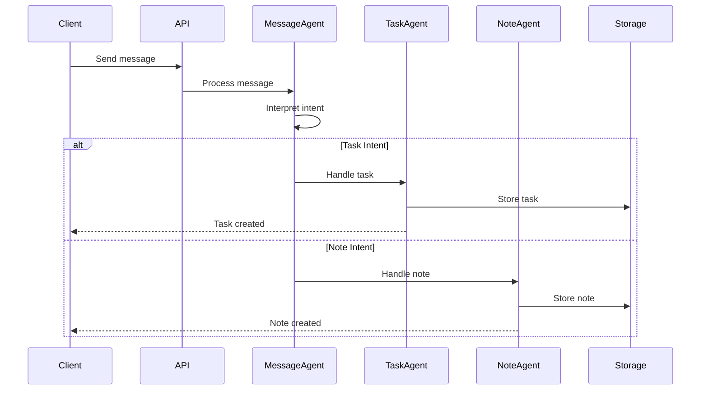
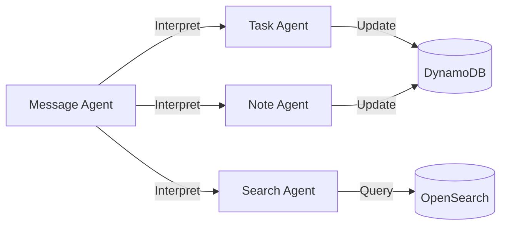

# System Architecture

## Overview

The Obsidian AI Assistant is built using a serverless architecture on AWS, leveraging various AWS services to create a scalable, maintainable, and cost-effective system. This document explains the architectural decisions and their rationale.

## System Diagram

```mermaid
graph TB
    subgraph Client
        O[Obsidian Client]
        API[API Client]
    end

    subgraph AWS
        subgraph API Gateway
            AG[API Gateway]
        end

        subgraph Lambda Functions
            PM[Process Message]
            CN[Create Note]
            GN[Get Note]
            UN[Update Note]
            DN[Delete Note]
            GE[Generate Embeddings]
            SN[Search Notes]
            LN[List Notes]
            CT[Create Task]
            GT[Get Task]
            UT[Update Task]
            DT[Delete Task]
            LT[List Tasks]
        end

        subgraph Storage
            DDB[(DynamoDB)]
            S3[(S3)]
            OS[(OpenSearch)]
        end

        subgraph External Services
            OAI[OpenAI API]
        end

        subgraph Agents
            MA[Message Agent]
            TA[Task Agent]
            NA[Note Agent]
            SA[Search Agent]
        end
    end

    %% Client connections
    O -->|HTTP| AG
    API -->|HTTP| AG

    %% API Gateway to Lambda
    AG -->|POST /messages| PM
    AG -->|POST /notes| CN
    AG -->|GET /notes/{id}| GN
    AG -->|PUT /notes/{id}| UN
    AG -->|DELETE /notes/{id}| DN
    AG -->|POST /embeddings| GE
    AG -->|GET /search| SN
    AG -->|GET /notes| LN
    AG -->|POST /tasks| CT
    AG -->|GET /tasks/{id}| GT
    AG -->|PUT /tasks/{id}| UT
    AG -->|DELETE /tasks/{id}| DT
    AG -->|GET /tasks| LT

    %% Message Processing
    PM -->|Interpret| MA
    MA -->|Task Request| TA
    MA -->|Note Request| NA
    MA -->|Search Request| SA

    %% Task Operations
    TA -->|Create| CT
    TA -->|Update| UT
    TA -->|Delete| DT
    TA -->|List| LT

    %% Note Operations
    NA -->|Create| CN
    NA -->|Update| UN
    NA -->|Delete| DN
    NA -->|List| LN

    %% Search Operations
    SA -->|Search| SN

    %% Lambda to Storage
    CN -->|Store metadata| DDB
    CN -->|Store content| S3
    CN -->|Store embeddings| OS
    
    GN -->|Get metadata| DDB
    GN -->|Get content| S3
    
    UN -->|Update metadata| DDB
    UN -->|Update content| S3
    UN -->|Update embeddings| OS
    
    DN -->|Delete metadata| DDB
    DN -->|Delete content| S3
    DN -->|Delete embeddings| OS
    
    SN -->|Search| OS
    LN -->|List| DDB

    %% Task Storage
    CT -->|Store task| DDB
    GT -->|Get task| DDB
    UT -->|Update task| DDB
    DT -->|Delete task| DDB
    LT -->|List tasks| DDB

    %% Lambda to External Services
    GE -->|Generate embeddings| OAI
```

## Message Processing Flow

### 1. Message Reception


### 2. Message Storage
```json
{
    "message_id": "uuid",
    "content": "string",
    "timestamp": "timestamp",
    "type": "task|note",
    "status": "pending|processed|failed",
    "metadata": {
        "user_id": "string",
        "context": "string",
        "priority": "high|medium|low"
    }
}
```

## Agent Communication

### 1. Agent Types
- **Message Agent**: Interprets user messages and routes to appropriate agents
- **Task Agent**: Handles task creation, updates, and management
- **Note Agent**: Manages note operations and content
- **Search Agent**: Handles search queries and results

### 2. Agent Interaction


## Architectural Decisions

### 1. Serverless Architecture

#### Why Lambda?
- **Cost Efficiency**: Pay only for actual compute time
- **Auto-scaling**: Automatic handling of varying workloads
- **Zero Infrastructure Management**: No server maintenance required
- **Event-Driven**: Perfect for handling API requests and background tasks

#### Implementation Details
- Each Lambda function is focused on a single responsibility
- Functions are organized by feature (notes, embeddings, search)
- Common code is shared through Lambda layers
- Cold starts are minimized through function optimization

### 2. Storage Strategy

#### DynamoDB Tables
```json
{
    "notes_metadata": {
        "note_id": "string (partition key)",
        "title": "string",
        "created_at": "timestamp",
        "updated_at": "timestamp",
        "tags": ["string"],
        "user_id": "string",
        "status": "active|archived"
    },
    "tasks_metadata": {
        "task_id": "string (partition key)",
        "title": "string",
        "description": "string",
        "status": "todo|in_progress|done",
        "priority": "high|medium|low",
        "due_date": "timestamp",
        "created_at": "timestamp",
        "updated_at": "timestamp",
        "user_id": "string",
        "project_id": "string",
        "dependencies": ["task_id"]
    },
    "messages_metadata": {
        "message_id": "string (partition key)",
        "content": "string",
        "timestamp": "timestamp",
        "type": "task|note",
        "status": "pending|processed|failed",
        "user_id": "string",
        "context": "string",
        "priority": "high|medium|low"
    }
}
```

#### S3 Buckets
- `notes-content`: Stores note content in markdown format
- `task-attachments`: Stores task-related files and attachments
- `message-attachments`: Stores message-related files and attachments

#### OpenSearch Indices
- `notes-index`: Stores note embeddings and searchable content
- `tasks-index`: Stores task embeddings and searchable content

## Event Flow

### 1. Message Processing
1. Client sends message to API Gateway
2. API Gateway routes to Process Message Lambda
3. Message Agent interprets intent
4. Based on intent:
   - Task Agent handles task operations
   - Note Agent handles note operations
   - Search Agent handles search operations
5. Results stored in appropriate storage
6. Response sent back to client

### 2. Task Creation
1. Message Agent identifies task intent
2. Task Agent validates task data
3. Task stored in DynamoDB
4. Task embeddings generated and stored in OpenSearch
5. Task created notification sent to client

### 3. Note Creation
1. Message Agent identifies note intent
2. Note Agent validates note data
3. Note metadata stored in DynamoDB
4. Note content stored in S3
5. Note embeddings generated and stored in OpenSearch
6. Note created notification sent to client

## Security

### 1. Authentication
- AWS Cognito for user authentication
- JWT tokens for API requests
- IAM roles for Lambda functions

### 2. Authorization
- Resource-based policies for S3 buckets
- IAM policies for DynamoDB access
- API Gateway authorizers

### 3. Data Protection
- Encryption at rest for all storage
- TLS for data in transit
- KMS for key management
- Regular security audits

## Monitoring

### 1. Metrics
- API Gateway metrics
- Lambda execution metrics
- DynamoDB performance metrics
- OpenSearch cluster metrics
- Custom business metrics

### 2. Logging
- CloudWatch Logs for all Lambda functions
- X-Ray for request tracing
- Custom structured logging

### 3. Alerts
- Error rate thresholds
- Latency thresholds
- Cost thresholds
- Custom business alerts

## Future Considerations

### 1. Scalability
- Multi-region deployment
- Read replicas for DynamoDB
- OpenSearch cluster scaling
- Lambda concurrency limits

### 2. Features
- Real-time collaboration
- Offline support
- Mobile applications
- Browser extensions

### 3. Integration
- Third-party calendar integration
- Email integration
- Project management tools
- AI model improvements 