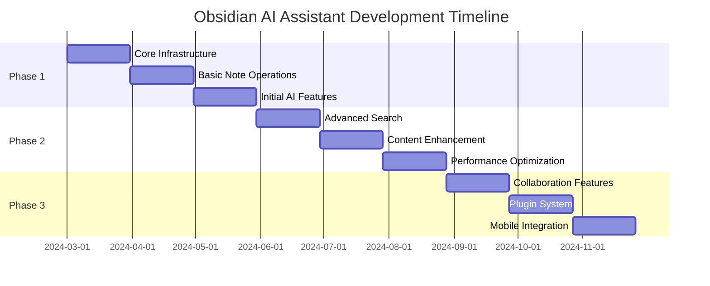

# Project Roadmap

This document outlines the development roadmap for the Obsidian AI Assistant project, including short-term, medium-term, and long-term goals.

## Timeline Overview

## Phase 1: Foundation (Q1 2024)

### Short-term Goals (1-3 months)

#### 1. Core Infrastructure
- [x] Set up AWS Lambda functions
- [x] Configure DynamoDB tables
- [x] Set up S3 buckets
- [x] Configure OpenSearch domain
- [x] Implement basic API Gateway

#### 2. Basic Note Operations
- [x] Create note functionality
- [x] Read note functionality
- [x] Update note functionality
- [x] Delete note functionality
- [x] List notes functionality

#### 3. Initial AI Features
- [x] Basic embedding generation
- [x] Simple semantic search
- [x] Basic content enhancement
- [x] Error handling and logging

### Current Focus
- Optimizing Lambda function performance
- Improving error handling
- Enhancing test coverage
- Documentation completion

## Phase 2: Enhancement (Q2 2024)

### Medium-term Goals (3-6 months)

#### 1. Advanced Search
- [ ] Vector similarity search
- [ ] Full-text search
- [ ] Faceted search
- [ ] Search result ranking
- [ ] Search filters and sorting

#### 2. Content Enhancement
- [ ] Content summarization
- [ ] Topic extraction
- [ ] Relationship mapping
- [ ] Content suggestions
- [ ] Grammar and style checking

#### 3. Performance Optimization
- [ ] Caching implementation
- [ ] Query optimization
- [ ] Resource utilization
- [ ] Cost optimization
- [ ] Response time improvement

### Upcoming Tasks
- Implement advanced search features
- Develop content enhancement algorithms
- Optimize system performance
- Enhance monitoring and alerting

## Phase 3: Expansion (Q3-Q4 2024)

### Long-term Goals (6-12 months)

#### 1. Collaboration Features
- [ ] Multi-user support
- [ ] Sharing and permissions
- [ ] Real-time updates
- [ ] Comments and annotations
- [ ] Version control

#### 2. Plugin System
- [ ] Plugin architecture
- [ ] Plugin marketplace
- [ ] Custom integrations
- [ ] Extension API
- [ ] Plugin management

#### 3. Mobile Integration
- [ ] Mobile app development
- [ ] Offline support
- [ ] Sync capabilities
- [ ] Mobile-optimized UI
- [ ] Push notifications

### Future Considerations
- Enterprise features
- Advanced analytics
- Custom AI models
- Integration with other tools
- Community features

## Technical Debt Management

### Current Technical Debt
1. **Code Quality**
   - Improve test coverage
   - Refactor complex functions
   - Update documentation
   - Standardize error handling

2. **Infrastructure**
   - Optimize Lambda configurations
   - Improve monitoring
   - Enhance security
   - Update dependencies

3. **Performance**
   - Optimize database queries
   - Implement caching
   - Reduce cold starts
   - Improve response times

### Debt Reduction Plan
1. **Q1 2024**
   - Complete test coverage
   - Update documentation
   - Standardize error handling

2. **Q2 2024**
   - Optimize infrastructure
   - Implement caching
   - Enhance monitoring

3. **Q3-Q4 2024**
   - Refactor complex code
   - Update dependencies
   - Improve performance

## Risk Management

### Identified Risks
1. **Technical Risks**
   - AWS service limitations
   - Performance bottlenecks
   - Security vulnerabilities
   - Integration challenges

2. **Project Risks**
   - Timeline delays
   - Resource constraints
   - Scope creep
   - Technical debt

### Mitigation Strategies
1. **Technical**
   - Regular security audits
   - Performance testing
   - Service monitoring
   - Backup strategies

2. **Project**
   - Agile methodology
   - Regular reviews
   - Resource planning
   - Scope management

## Success Metrics

### Key Performance Indicators
1. **Technical Metrics**
   - Response time < 200ms
   - Error rate < 0.1%
   - Test coverage > 90%
   - Uptime > 99.9%

2. **User Metrics**
   - User satisfaction
   - Feature adoption
   - Usage patterns
   - Feedback scores

### Monitoring Plan
1. **Daily**
   - Error rates
   - Response times
   - Resource usage
   - User feedback

2. **Weekly**
   - Performance trends
   - Usage patterns
   - Technical debt
   - Project progress

3. **Monthly**
   - Success metrics
   - Risk assessment
   - Resource planning
   - Timeline review 