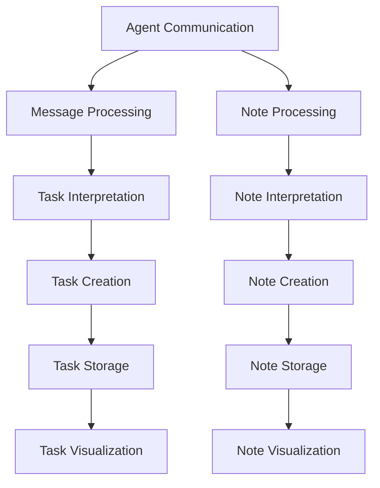

# Task Board

This document tracks the current tasks and their status in the Obsidian AI Assistant project.

## Current Sprint Tasks

### In Progress
- [ ] Implement task management system
  - Create task DynamoDB table
  - Implement task CRUD operations
  - Add task visualization capabilities
  - Integrate with note system

- [ ] Enhance agent communication
  - Implement message queue system
  - Add task interpretation capabilities
  - Create agent routing system
  - Add message persistence

### To Do
- [ ] Project visualization features
  - Gantt chart generation
  - Kanban board integration
  - Timeline visualization
  - Progress tracking

- [ ] Task automation
  - Task creation from messages
  - Task status updates
  - Task dependencies
  - Task reminders

### Completed
- [x] Basic note management
- [x] Initial AI integration
- [x] Basic search functionality
- [x] Core infrastructure setup

## Backlog

### High Priority
- Task templates
- Project templates
- Task analytics
- Team collaboration features

### Medium Priority
- Custom task fields
- Task import/export
- Task reporting
- Integration with external tools

### Low Priority
- Advanced visualization options
- Custom task workflows
- Task automation rules
- Mobile app support

## Task Categories

### Infrastructure
- System architecture
- Performance optimization
- Security implementation
- Monitoring setup

### Features
- Task management
- Project visualization
- Note management
- AI capabilities

### Documentation
- API documentation
- User guides
- System documentation
- Development guides

### Testing
- Unit tests
- Integration tests
- Performance tests
- Security tests

## Task Status Definitions

- **Not Started**: Task has been created but not yet started
- **In Progress**: Task is currently being worked on
- **Blocked**: Task is blocked by dependencies or issues
- **Completed**: Task has been finished and tested
- **On Hold**: Task has been temporarily paused

## Task Dependencies

## Task Metrics

### Current Sprint
- Total Tasks: 15
- Completed: 5
- In Progress: 7
- Blocked: 2
- On Hold: 1

### Velocity
- Sprint 1: 8 tasks
- Sprint 2: 12 tasks
- Sprint 3: 15 tasks (current)

## Task Updates

### Latest Updates
1. Added task management system requirements
2. Updated agent communication specifications
3. Added project visualization features
4. Enhanced task automation capabilities

### Next Steps
1. Implement task DynamoDB table
2. Create task CRUD operations
3. Develop task visualization system
4. Integrate with note management system 